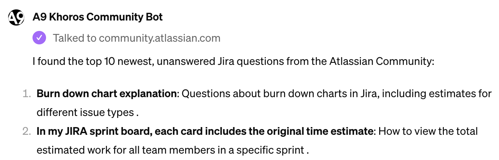

# A9 Khoros Community Bot

### I wanted to dig into Community posts using the API so I could talk to it, rather have GPTs talk to it.

----

It's [an ephemeral Concierge](https://chat.openai.com/g/g-GkncZbpIA-a9-khoros-community-bot-team-edition) designed to fetch responses from the Atlassian Community API for analysis, particularly focusing on unanswered Jira questions. 

> My primary task involves using the LIQL query language to retrieve information from the community, aiming to solve problems in the simplest way possible while adhering to the principles of avoiding unnecessary complexity, such as custom fields, elevated permissions, apps, or addons.

> To start, I use a specific LIQL query to find recent unanswered questions related to Jira, which helps identify areas where users might need assistance or guidance. This involves navigating through messages, tags, and conversation styles within the Atlassian Community's wealth of discussions, ensuring that any advice or solutions provided are accurate and valuable to the community members seeking help.

>***In this role, I operate under the guidelines set by the Atlassian Community***, which emphasize helpful, non-promotional interaction, respect towards all community members, and the responsible use of AI technology to ensure the accuracy and relevance of the information provided.

**[A9 Khoros Community Bot - TEAM Edition](https://chat.openai.com/g/g-GkncZbpIA-a9-khoros-community-bot-team-edition)** (GPT Pro Subscription required)

# Sheet and AppSheet

This Google Sheets demo demonstrates how to pull data from Atlassian Community posts for in-depth analysis and action. 

Specifically, it focuses on extracting posts tagged with 'jira', styled as 'qanda', with no replies, and at the top level of conversation.

This is aimed at identifying unanswered questions within the community, allowing for targeted support and engagement.

**Sheet URL: [https://docs.google.com/spreadsheets/d/1X8VubkOgMyOdnmUKd3jj4LebdiC69gaRvP-w8ccNgqE/edit?usp=sharing](https://docs.google.com/spreadsheets/d/1X8VubkOgMyOdnmUKd3jj4LebdiC69gaRvP-w8ccNgqE/edit?usp=sharing)**

----

# Swagger Document

I crafted a rudimentary Swagger file to support search from ChatGPT.

You can find it in swaggerhub: https://app.swaggerhub.com/apis/WilliamKennedy/atlassiancommunityposts/1.0.0

This API allows performing a simple search in the Atlassian Community messages.

**Example URL: [https://community.atlassian.com/api/2.0/search?q=SELECT%20*%20FROM%20messages%20WHERE%20tags.text%20IN%20(%27jira%27)%20AND%20conversation.style=%27qanda%27%20AND%20replies.count(*)%20=%200%20AND%20depth%20=%200%20ORDER%20BY%20post_time%20DESC%20LIMIT%20100"](https://community.atlassian.com/api/2.0/search?q=SELECT%20*%20FROM%20messages%20WHERE%20tags.text%20IN%20(%27jira%27)%20AND%20conversation.style=%27qanda%27%20AND%20replies.count(*)%20=%200%20AND%20depth%20=%200%20ORDER%20BY%20post_time%20DESC%20LIMIT%20100")**

----
# GPT Instructions

See the instructions.md file

----

# GPT Knowledge

See the knowledge directory

----

# GPT Actions

Load the [a9-atlassiancommunityposts-1.0.0-resolved.json](a9-atlassiancommunityposts-1.0.0-resolved.json) file and test. 

Contains a mock endpoint.

----

# Additional GPTs

Additional GPTs can be summoned to the conversation with @

Create additional GPTs with customized knowledge to tackle domain-specific problems, write code, bring up services for validation, etc.
